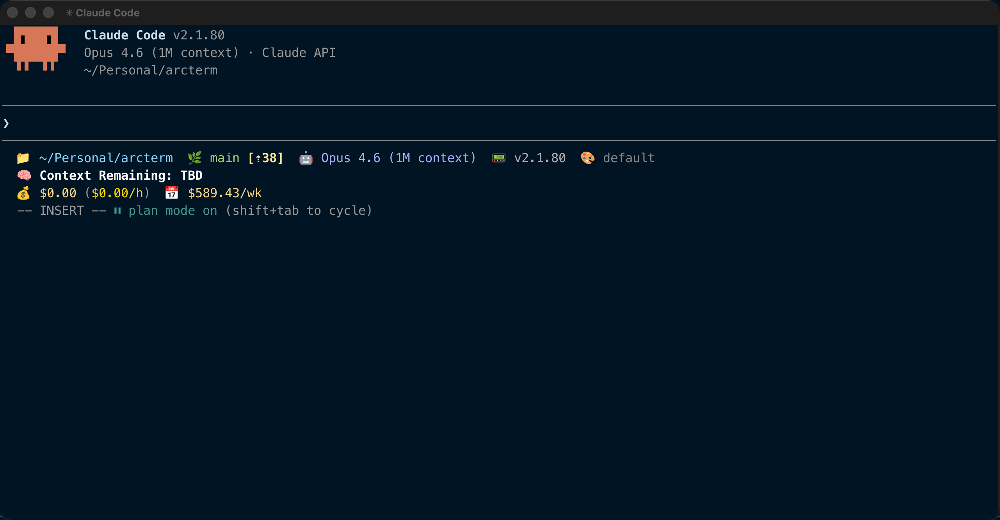

# ArcTerm


**An AI-native GPU-accelerated terminal emulator.** Built on [WezTerm](https://github.com/wez/wezterm), extended with WASM plugins, structured output, and local AI integration powered by [Ollama](https://ollama.com).

<br clear="left"/>



## Features

### AI Assistant
Open an AI pane alongside your terminal (`Ctrl+A` then `i`) that reads your terminal context — scrollback, working directory, last command — and answers questions about what you're seeing. Powered by Ollama running locally. No data leaves your machine.

### Command Generator
Press `Ctrl+Space` for a compact command panel at the bottom. Type what you want in plain English, get a shell command back. Press Enter to run it.

### Agent Mode
Type `# deploy to staging` at your shell prompt. ArcTerm breaks the task into steps, shows each command with an explanation, and executes them one at a time with your review. Skip steps with `s`, abort with `q`.

### Inline Suggestions
As you type, ghost text appears suggesting command completions — like GitHub Copilot for your terminal. Tab to accept, keep typing to dismiss. Context-aware: reads your recent output and working directory.

### Structured Output (OSC 7770)
CLI tools can send rich content to ArcTerm: syntax-highlighted code blocks, collapsible JSON trees, colored diffs, and inline images. Other terminals silently ignore the escape sequences. [Protocol docs](docs/osc-7770-protocol.md).

### WASM Plugin System
Extend ArcTerm with sandboxed WebAssembly plugins. Plugins run in isolated wasmtime instances with capability-based permissions — they can only access what you explicitly grant (filesystem paths, network hosts, terminal I/O). [Plugin development guide](CONTRIBUTING.md#developing-wasm-plugins).

## Quick Start

### Prerequisites
- Rust toolchain (1.71+)
- [Ollama](https://ollama.com) for AI features (optional but recommended)

### Build and Run

```bash
git clone https://github.com/lgbarn/arcterm.git
cd arcterm
cargo build --release
cargo run --bin wezterm-gui
```

### Set Up AI Features

```bash
# Install Ollama (macOS)
brew install ollama

# Start Ollama and pull the recommended model
ollama serve &
ollama pull qwen2.5-coder:7b
```

Create `~/.config/arcterm/arcterm.lua`:

```lua
local wezterm = require 'wezterm'
local config = wezterm.config_builder()

config.leader = { key = 'a', mods = 'CTRL', timeout_milliseconds = 1000 }
config.keys = {
  { key = 'i', mods = 'LEADER', action = wezterm.action.OpenAiPane },
  { key = ' ', mods = 'CTRL', action = wezterm.action.ToggleCommandOverlay },
}

return config
```

That's it. AI features work immediately with Ollama on the default port.

See [docs/getting-started.md](docs/getting-started.md) for the full guide and [docs/local-llm-setup.md](docs/local-llm-setup.md) for detailed Ollama setup.

## Configuration

ArcTerm uses `arcterm.lua` as its config file (falls back to `wezterm.lua` for migration). Full WezTerm Lua API compatibility — your existing WezTerm config works.

```
~/.config/arcterm/arcterm.lua    # Linux/macOS (XDG)
~/.arcterm.lua                   # Home directory
```

## Upstream Relationship

ArcTerm is a fork of [WezTerm](https://github.com/wez/wezterm) by Wez Furlong (MIT license). Internal crate names remain `wezterm-*` to keep upstream merges clean. ArcTerm-specific code lives in dedicated `arcterm-*` crates.

```bash
# Sync with upstream
git fetch upstream
git merge upstream/main
```

## Architecture

| Crate | Purpose |
|-------|---------|
| `arcterm-ai` | LLM backends (Ollama/Claude), context extraction, suggestions, agent mode |
| `arcterm-wasm-plugin` | WASM sandbox, capability enforcement, host API, plugin lifecycle |
| `arcterm-structured-output` | OSC 7770 renderers (code, JSON, diff, image) |
| `wezterm-gui` | Main GUI binary + AI pane, command overlay, suggestion overlay |
| `term` | Terminal emulation (VT parsing, escape sequences) |
| `mux` | Multiplexer (tabs, panes, sessions) |
| `config` | Configuration and Lua plugin system |

## Contributing

See [CONTRIBUTING.md](CONTRIBUTING.md) for development setup, feature-specific guides, WASM plugin development, and the OSC 7770 protocol.

## License

MIT — same as upstream WezTerm.
